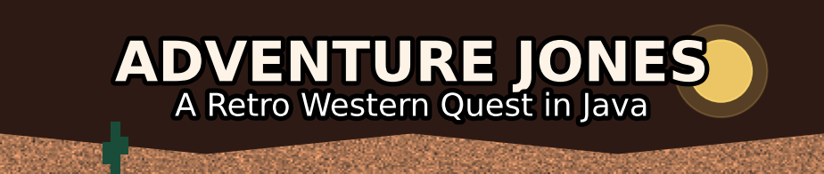

<div id="top">

<!-- HEADER STYLE: WILD WEST BANNER -->
<div align="center">



<!-- BADGES -->


<em>Built with the tools and technologies:</em> Java, Swing, OOP, and game asset management.

</div>

---

## Table of Contents

- [Overview](#overview)
- [Features](#features)
- [Project Structure](#project-structure)
  - [Project Index](#project-index)
- [Getting Started](#getting-started)
  - [Prerequisites](#prerequisites)
  - [Installation](#installation)
  - [Usage](#usage)
  - [Testing](#testing)
- [Roadmap](#roadmap)
- [Contributing](#contributing)
- [License](#license)
- [Acknowledgments](#acknowledgments)
- [Credits](#credits)

---

## Overview

**Adventure-Jones-4** is a retro-inspired 2D adventure game where you explore dungeons, solve puzzles, and battle monsters using classic weapons and abilities. The goal: collect all ancient artifacts and uncover the final secret of the Jones legacy.

> A homage to classic pixel art RPGs with a modern codebase built in Java.

---

## Features

- 🎮 Top-down 2D gameplay with grid-based tile interaction
- 🧠 AI pathfinding for monster and NPC movement
- 🔊 Original sound effects and background music
- 🗺️ Multi-map exploration system
- 💬 NPC dialog interactions
- 🧰 Configurable settings via `config.txt`
- ⚔️ Inventory: swords, whips, bows, medkits, and artifacts
- 🧟 Unique enemies: Mecha, Tyanak, Dwarf, Death, and more
- 🔥 Destructible environment tiles: bushes, barrels, etc.

---

## Project Structure

```css
📁 Adventure-Jones-4/
│
├── 📁 src/
│ ├── 📁 entities/ # Player, NPCs, Enemies, Projectiles
│ ├── 📁 weapons/ # Weapon classes (Pistol, Whip, Bow, etc.)
│ ├── 📁 maps/ # Level loading, transitions, tilesets
│ ├── 📁 ui/ # Dialog boxes, health bars, overlays
│ ├── 📁 audio/ # Music and sound effect managers
│ ├── 📁 main/ # Main entry point and core loop
│ └── 📁 util/ # Helpers, game timer, collision logic
│
├── 📁 assets/ # Sprites, audio files, maps, fonts
├── 📁 bin/ # Compiled class files
├── README.md
└── .gitignore
```

---

## Getting Started

### Prerequisites

- Java 17+
- Git (for cloning)
- IDE (e.g., IntelliJ, Eclipse) or use `javac` in terminal

---

### Installation

```bash
git clone https://github.com/Roland-Front-Back/Adventure-Jones-4.git
cd Adventure-Jones-4
```

---

## Usage

Compile and run the game using your IDE or via terminal:

```bash
javac -d bin src/\*_/_.java
java -cp bin main.Main
```

You can modify config.txt to tweak game behavior.

---

## Testing

Manual testing is recommended. Automated unit tests (optional) can be added using JUnit if desired.

---

## Roadmap

- [ ] Add save/load game functionality

- [ ] Implement boss attack phases

- [ ] Add controller support

- [ ] Create more unique maps and puzzles

- [ ] Refactor AI for better pathfinding performance

---

## Contributing

Contributions are welcome! To contribute:

1. Fork the repo

2. Create a feature branch: git checkout -b feature/my-feature

3. Commit your changes: git commit -m 'Add some feature'

4. Push to the branch: git push origin feature/my-feature

5. Open a Pull Request

6. Please follow consistent code style and include brief summaries for major changes.

---

## License

Distributed under the MIT License.
See LICENSE for more information.
Acknowledgments

- Sound effects by <a href="https://freesound.org">freesound.org</a>

- Fonts from <a href="https://www.dafont.com">dafont.com</a>

- Inspired by The Legend of Zelda, Indiana Jones, and Secret of Mana

---

## Acknowledgments

- <a href="https://freesound.org">freesound.org</a> for open sound effects

- <a href="https://www.dafont.com">dafont.com</a> for custom pixel fonts

- Inspiration from The Legend of Zelda, Indiana Jones, and other classic action-adventure games

- Java/Swing documentation for GUI components and event handling

---

## Credits

- Programming: Group 4

- Concept & Design: Retro game inspirations

- Music: Custom SFX or royalty-free music

- Engine: Java + JavaFX

---

<div align="right"><a href="#top">Back to top</a></div>

</div>
